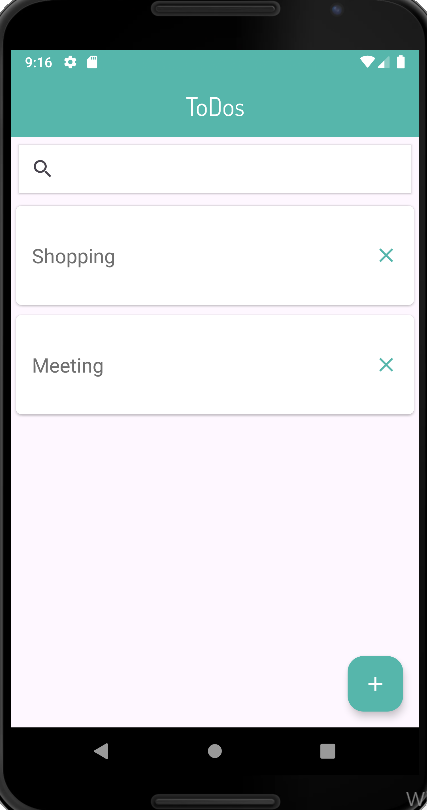
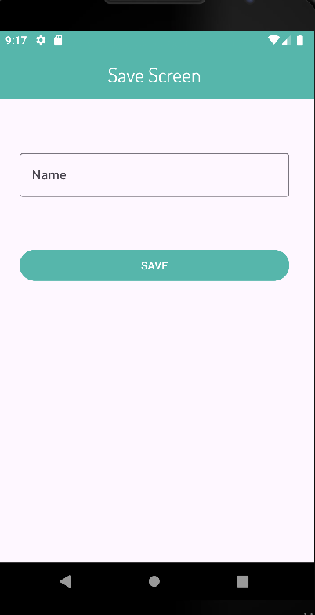
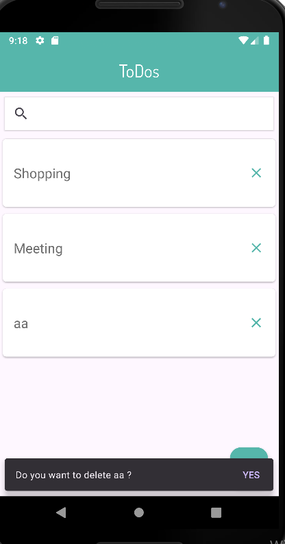

# TodoApp Repository

Bu repository, aynı Todo uygulamasının farklı mimari desenler ve teknolojiler kullanılarak geliştirilmiş iki versiyonunu içerir.
# Temel Tasarım
- To Do eklemek için sağ alt köşede bir buton bulunur.
- Eklenen To Do'lar uygulamanın açılış ekranında listelenir.
- Her To Do için silme butonu bulunur. Tıklandığında en altta bir onay uyrasını açılır.
- 
## Uygulamadan Görüntüler

- 

- 


## Projeler

### 1. MVVM, Hilt ve Retrofit Kullanılan Versiyon
Bu proje, MVVM mimarisi, Hilt ile bağımlılık enjeksiyonu ve Retrofit ile ağ işlemleri kullanılarak geliştirilmiştir.

#### Dosya Yapısı
- mvvm_hilt_retrofit/
- ├── app/
- │ ├── src/
- │ └── build.gradle
- └── build.gradle
#### Kurulum ve Çalıştırma
1. Projeyi klonlayın:
    ```bash
    git clone https://github.com/kullaniciadi/TodoAppRepo.git
    ```
2. MVVM, Hilt ve Retrofit projesi dizinine gidin:
    ```bash
    cd TodoAppRepo/mvvm_hilt_retrofit
    ```
3. Gradle bağımlılıklarını indirin ve projeyi çalıştırın:
    ```bash
    ./gradlew build
    ./gradlew run
    ```

#### Kullanılan Teknolojiler
- **Kotlin**
- **MVVM**
- **Hilt**
- **Retrofit**
- **LiveData**
- **ViewModel**

### 2. Room Kullanılan Versiyon
Bu proje, yerel veritabanı işlemleri için Room kütüphanesi kullanılarak geliştirilmiştir. Room, SQLite veritabanını yönetmek için kullanılır.

#### Dosya Yapısı
- room/
- ├── app/
- │ ├── src/
- │ └── build.gradle
- └── build.gradle
#### Kurulum ve Çalıştırma
1. Projeyi klonlayın:
    ```bash
    git clone https://github.com/kullaniciadi/TodoAppRepo.git
    ```
2. Room projesi dizinine gidin:
    ```bash
    cd TodoAppRepo/room
    ```
3. Gradle bağımlılıklarını indirin ve projeyi çalıştırın:
    ```bash
    ./gradlew build
    ./gradlew run
    ```

#### Kullanılan Teknolojiler
- **Kotlin**
- **Room**
- **SQLite**
- **LiveData**
- **ViewModel**

### Sonuç
Bu repository, aynı Todo uygulamasının farklı mimari desenler ve teknolojiler kullanılarak geliştirilmiş iki versiyonunu içermektedir. Proje, özellikle Retrofit ve Room gibi farklı veri yönetimi mimarilerinin karşılaştırılması ve öğrenilmesi amacıyla tasarlanmıştır.

#### Farklılıklar
##### Retrofit:

- HTTP istekleri üzerinden uzak sunucularla iletişim kurmak için kullanılır.
- RESTful API'ler ile entegrasyon sağlar.
- JSON veri dönüşümleri için kolay entegrasyon sunar.
- Genellikle ağ işlemleri için tercih edilir.
###### Room:

- SQLite veritabanı üzerinde yerel veri depolama ve işlemleri yapmak için kullanılır.
- Veritabanı erişim nesnelerini (DAO) kullanarak veritabanı işlemlerini yönetir.
- Veri tutarlılığı ve yerel veri yönetimi için tercih edilir.
- LiveData gibi bileşenlerle Android uygulamalarına entegrasyon sağlar.

#### Öğrenme Amaçlı Kullanım
Bu proje, Android uygulama geliştirme sürecinde farklı veri yönetimi mimarileri ve bağımlılık enjeksiyonu gibi kavramların uygulamalı olarak öğrenilmesi için idealdir. Her iki versiyonu inceleyerek, Retrofit ile ağ işlemleri ve API entegrasyonu nasıl yapıldığını ve Room ile SQLite veritabanı işlemlerinin nasıl gerçekleştirildiğini pratik olarak görebilirsiniz.
